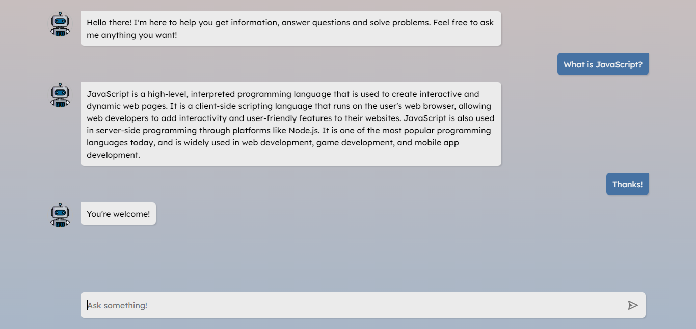

# AI Chatbot

Simple chatbot that uses OpenAI's gpt-3.5-turbo language model to generate responses based on user input.

## Preview

You can check out the app [here](https://ai-powered-chatbot.netlify.app/).

## Technologies

### Backend:

In order not to show the API key on the front-end, the connection is established through an endpoint created with the Express.js framework, which makes the request and returns the data to the front-end. There is a limitation of 15 messages per day for each user.

### Frontend:

This interface and layout was made from scratch by me using HTML, CSS and Vanilla JavaScript.
